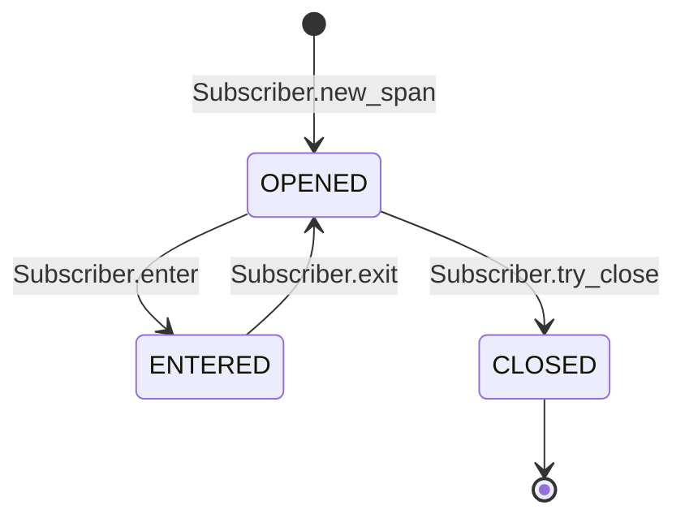

# Spans

A [`Span`] represents a period of time with a *beginning* and an *end*. 

## Lifecycle

```mermaid
stateDiagram-v2
    [*] --> OPENED: Subscriber.new_span
    OPENED --> ENTERED: Subscriber.enter
    ENTERED --> OPENED: Subscriber.exit
    OPENED --> CLOSED: Subscriber.try_close
    CLOSED --> [*]
```
